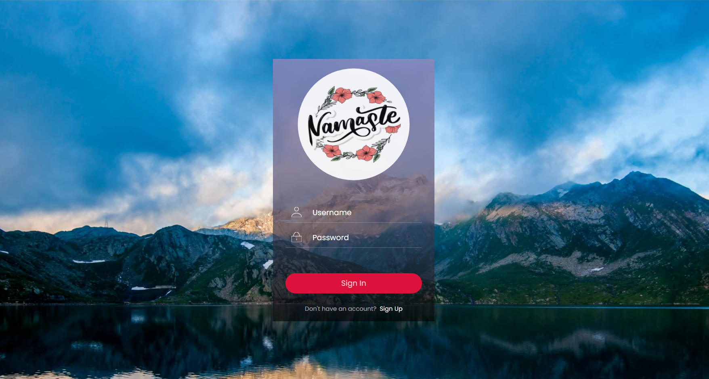

# Assalamu Alaikum Messenger

It is basically a realtime chatting website having login authentication portal with unique session for each unique user. This project is created using PHP for backend, mySQL for database storage and Bootstrap 4 with some CSS for frontend development. 

[]

